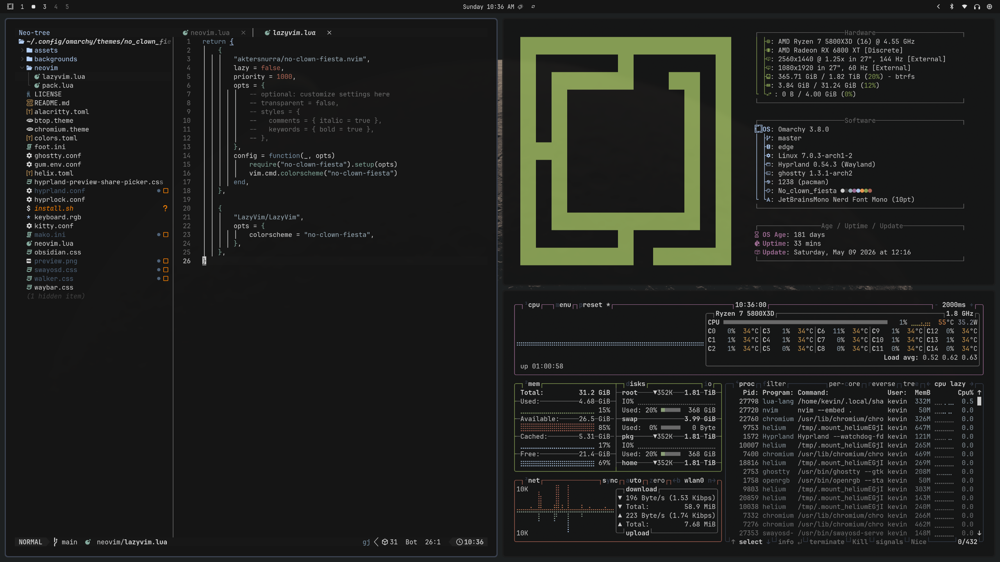

# omarchy-no-clown-fiesta-theme
An omarchy theme based on the "no-clown-fiesta" neovim colorsheme

Shoutout to aktersnurra, the creator of [no-clown-fiesta](https://github.com/aktersnurra/no-clown-fiesta.nvim) for making a beautiful dark grey colorscheme thats both readable and easy on the eyes :) 

# Installation
## Step 1
Pull the theme onto your system using one of the following methods
### Terminal
`omarchy theme install https://github.com/KevinStirling/omarchy-no-clown-fiesta-theme`
### Walker menu
Copy this link: https://github.com/KevinStirling/omarchy-no-clown-fiesta-theme

Open Walker, SUPER+ALT+SPACE, navigate to: Install < Style < Theme

Paste: CTRL+SHIFT+V, then press enter/return.
## Step 2 (optional)
This is only nessesary if your neovim config is using vim.pack as the package manager. If you are on LazyVim (omarchy default), you can skip this.

Running this in your terminal will auto detect the neovim package manager installation, and switch between the two theme files found in `/neovim`

`cd ~/.config/omarchy/themes/no_clown_fiesta/ && chmod +x install.sh && ./install.sh`

